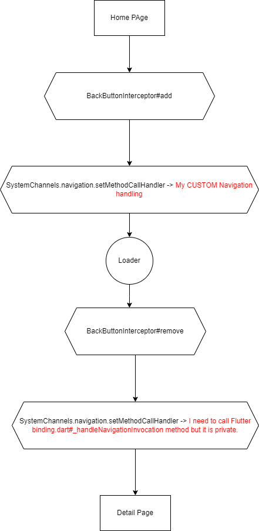

# handle_navigation_use_case

Example app for flutter
issue [#132896](https://github.com/flutter/flutter/issues/132893#issue-1857772748) and
pr [132896](https://github.com/flutter/flutter/pull/132896)

## Problem

In this example application, we use the command "SystemChannels.navigation.setMethodCallHandler(_
handleNavigationInvocation)" to capture the back button command coming from the Android operating
system.
The _handleNavigationInvocation we have set up is actually a copy of the _handleNavigationInvocation
method found within Flutter.
We use our invocation to prevent the back button event sent from Android.
However, within Flutter's invocation, there is an entry called "pushRouteInformation" (_
handlePushRouteInformation), which is a private method.
Since we cannot copy this method, the deep linking feature that relies on this connection does not
work.
If SystemChannels.navigation.setMethodCallHandler can be modified at runtime, we need to be able to
access its old value, and it should be adjustable.
The lines you need to review are back_button_interceptor line: 70, 79.

## Steps to Follow

- [`context.loaderOverlay.show()`](./lib/page/home_page.dart#L25)
- [`loaderOverlay.build()`](./lib/loader_overlay/loader_overlay.dart#L150)
- [`backButtonInterceptor.add()`](./lib/back_button_interceptor/back_button_interceptor.dart#L69) At
  this point I removed flutter navigation handling mechanism with my custom navigation handler.
- [`context.loaderOverlay.hide()`](./lib/page/detail_screen.dart#L20)
- [`loaderOverlay.build()`](./lib/loader_overlay/loader_overlay.dart#L152)
- [`backButtonInterceptor.remove()`](./lib/back_button_interceptor/back_button_interceptor.dart#L78)
  At this point I need to
  restore [flutter navigation handling](https://github.com/flutter/flutter/blob/ebd7610526087b7b406c6570e0a3a9489e5dc379/packages/flutter/lib/src/widgets/binding.dart#L778)
  mechanism. But it is private.

